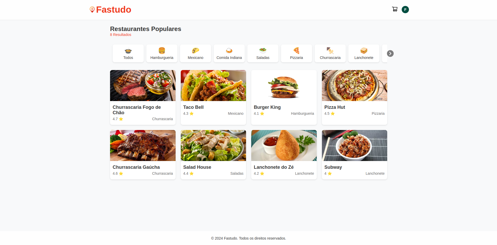

# Fastudo - Pedidos Online

Fastudo é um site de pedidos de restaurantes que permite aos usuários visualizar diferentes restaurantes, seus menus, adicionar itens ao carrinho, e realizar pedidos. Este projeto é construído usando as tecnologias modernas de desenvolvimento web para proporcionar uma ótima experiência ao usuário, tanto em dispositivos móveis quanto em desktop.

## Visão Geral

- **Nome do Projeto**: Fastudo
- **Descrição**: Um site de pedidos online que permite aos usuários visualizar restaurantes, explorar seus menus, adicionar itens ao carrinho, e concluir pedidos.
- **Tecnologias Utilizadas**: React, Styled-components, Context API, React Router

## Características

- **Listagem de Restaurantes**: Apresenta uma lista de restaurantes com categorias para fácil navegação.
- **Detalhes do Restaurante**: Cada restaurante possui uma página detalhada com informações sobre o menu, resenhas e detalhes sobre o local.
- **Carrinho de Compras**: Possibilidade de adicionar itens ao carrinho, visualizar os itens, remover itens e finalizar a compra.
- **Sistema de Notificações**: Notificações para ações como adição ou remoção de itens do carrinho.
- **Navegação Responsiva**: Interface totalmente adaptada para diferentes tamanhos de tela.
- **Semântica e Acessibilidade**: Uso de tags HTML semânticas e práticas de acessibilidade para garantir uma experiência inclusiva.

## Tecnologias Utilizadas

- **React**: Biblioteca principal para construção da interface do usuário.
- **Styled-components**: Biblioteca para estilização, permitindo criar componentes de estilo dinâmicos e reutilizáveis.
- **React Router**: Para navegação entre as páginas do aplicativo.
- **Context API**: Para gerenciamento de estado, como itens do carrinho e informações do usuário.
- **React Icons**: Utilizado para ícones, como o ícone de carrinho e perfil.

## Estrutura do Projeto

A estrutura de pastas do projeto é organizada da seguinte maneira:

```
fastudo/
├── public/
│   ├── assets/
│   │   └── img/
│   │       ├── banner/
│   │       ├── foods/
│   │       └── restaurants/
│   ├── favicon.png
│   ├── index.html
│   └── robots.txt
├── src/
│   ├── components/
│   │   ├── CartPopup.js
│   │   ├── Container.js
│   │   ├── FoodCategory.js
│   │   ├── Header.js
│   │   ├── Footer.js
│   │   ├── Notification.js
│   │   └── RestaurantCard.js
│   ├── context/
│   │   └── NotificationProvider.js
│   ├── features/
│   │   ├── Cart/
│   │   │   ├── CartContext.js
│   │   │   └── CartProvider.js
│   │   ├── Checkout/
│   │   │   └── Checkout.js
│   │   └── RestaurantDetail/
│   │       ├── AboutTab.js
│   │       ├── CategoryTab.js
│   │       └── ReviewsTab.js
│   ├── pages/
│   │   ├── Checkout.js
│   │   ├── Home.js
│   │   └── RestaurantDetail.js
│   ├── services/
│   │   ├── categoriesData.js
│   │   ├── restaurantsData.js
│   │   └── userData.js
│   ├── styles/
│   │   ├── GlobalStyles.js
│   │   └── theme.js
│   ├── App.js
│   └── index.js
├── .gitignore
├── package-lock.json
├── package.json
└── README.md
```

## Instruções de Instalação

Para rodar este projeto em sua máquina local, siga os seguintes passos:

### Pré-requisitos

Certifique-se de ter o [Node.js](https://nodejs.org/) instalado na versão LTS e o [npm](https://www.npmjs.com/) ou [yarn](https://yarnpkg.com/) como gerenciador de pacotes.

### Passos

1. Clone o repositório:

   ```bash
   git clone https://github.com/fbomateus/fastudo.git
   cd fastudo
   ```

2. Instale as dependências:

   ```bash
   npm install
   # ou
   yarn install
   ```

3. Inicie o servidor de desenvolvimento:

   ```bash
   npm start
   # ou
   yarn start
   ```

4. Abra seu navegador e acesse [http://localhost:3000](http://localhost:3000) para visualizar o projeto.

## Funcionalidades em Destaque

### Carrinho de Compras
- Os itens podem ser adicionados ao carrinho a partir da página de detalhes do restaurante.
- O usuário pode abrir o `CartPopup` clicando no ícone de carrinho para visualizar ou remover itens.

### Sistema de Notificações
- A aplicação inclui um sistema de notificações que avisa os usuários sobre ações, como adição ou remoção de itens do carrinho.

### Responsividade
- A interface se ajusta a diferentes tamanhos de tela, sendo possível ver 4, 3, 2 ou 1 item por linha, dependendo do tamanho do dispositivo.
- O Header, categorias, e outras seções são otimizadas para visualização em dispositivos móveis e desktop.

## Estilização e UI/UX
- **Styled-components** é utilizado para criar componentes estilizados e garantir que a estilização seja modular e reutilizável.
- Ícones são gerenciados usando a biblioteca `react-icons` para proporcionar uma experiência visual amigável.
- A interface é projetada para ser simples e intuitiva, com botões de ação claros e feedback visual.

## Como Contribuir

1. Faça um fork do projeto.
2. Crie uma branch para sua funcionalidade (`git checkout -b minha-funcionalidade`).
3. Faça o commit de suas mudanças (`git commit -m 'Adiciona nova funcionalidade'`).
4. Envie para o branch (`git push origin minha-funcionalidade`).
5. Abra um Pull Request.

## Contato

Caso tenha dúvidas ou queira colaborar, entre em contato:
- **Email**: fabiomateus.jobs@gmail.com
- **GitHub**: [fbomateus](https://github.com/fbomateus)

Sinta-se à vontade para contribuir e tornar o Fastudo ainda melhor!

## Imagens do Projeto

### Página Inicial



### Página de Detalhes do Restaurante


### Página de Checkout

